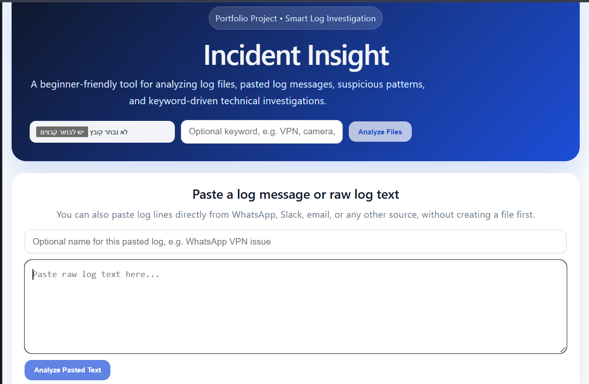
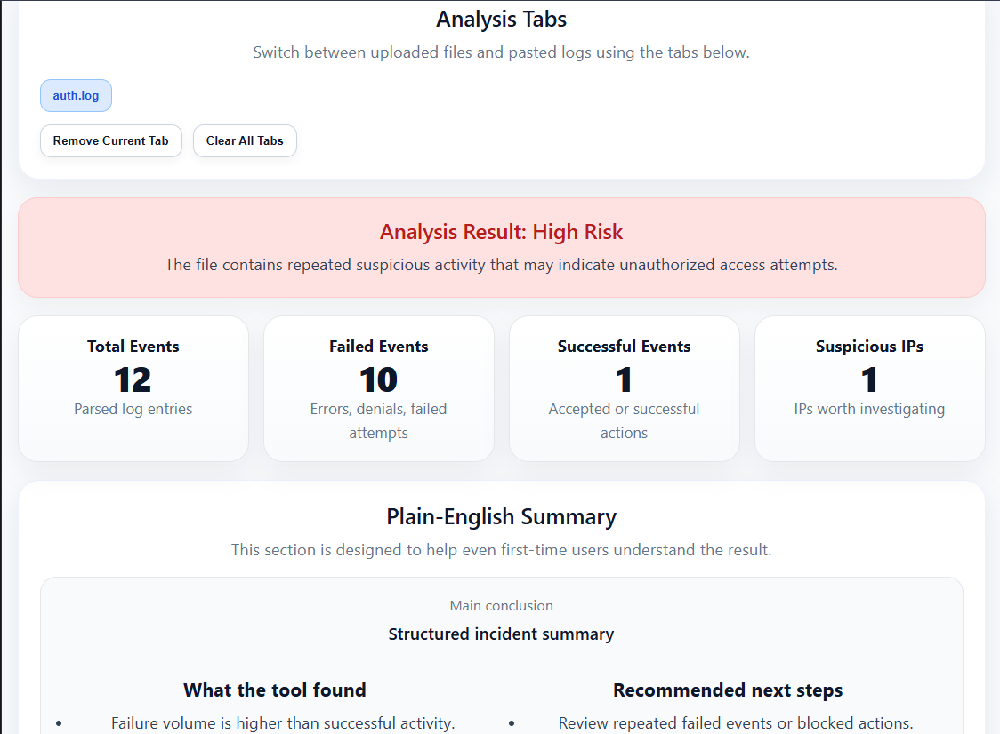
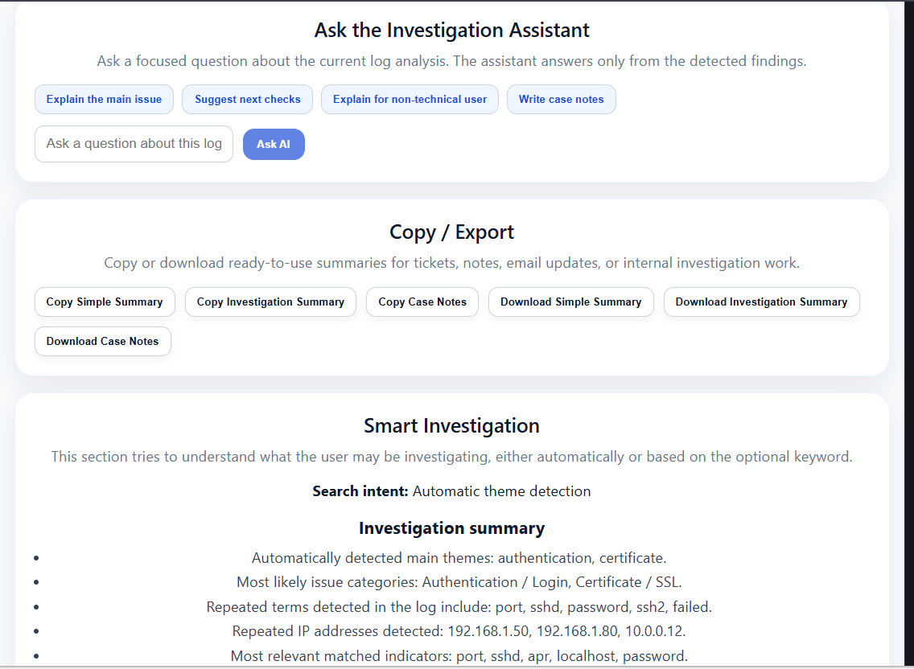

# Incident Insight

Incident Insight is a smart log investigation assistant designed to help support, operations, and technical teams understand logs more easily.

Instead of manually scanning raw log lines, users can upload log files or paste raw log text and receive readable investigation outputs such as repeated indicators, likely issue categories, glossary-based explanations, and ready-to-use summaries.

## Key Highlights

* Built a full-stack investigation tool using **FastAPI** and **React**
* Supports **multi-file upload** and **pasted raw log text**
* Detects **repeated IPs**, **repeated indicators**, and **likely issue categories**
* Supports **custom glossary-based explanations** for company-specific or product-specific terms
* Includes a **local investigation assistant** for explanations, next checks, and case notes
* Allows users to **copy** and **download** summaries as TXT files

## Screenshots

### Home / Input View



### Investigation Results



### Investigation Assistant



## What the Application Does

Incident Insight helps users work with raw logs in a more readable and structured way.

The application allows users to:

* upload one or more log files
* paste raw log text directly into the UI
* detect repeated terms and repeated IP addresses
* identify likely issue categories such as authentication, DNS, certificate, VPN, proxy, camera/device traffic, and timeout/connectivity
* explain internal or product-specific terms using a custom glossary
* review the most relevant log lines and why they were flagged
* generate readable summaries and support-oriented case notes
* copy or download investigation outputs

## Main Features

* Multi-file log upload
* Pasted raw log text support
* Automatic pattern detection
* Repeated terms analysis
* Repeated IP detection
* Likely issue category detection
* Suggested follow-up keywords
* Custom glossary support
* Explained terms detected in the current log
* Local investigation assistant with rule-based interpretation
* Copy to clipboard actions
* Download summaries as TXT files
* Tab-based browsing between multiple analyzed logs

## Tech Stack

### Backend

* Python
* FastAPI

### Frontend

* React
* Vite
* Axios
* Recharts

### Logic

* Rule-based parsing
* Repeated indicator detection
* Theme detection
* Issue category ranking
* Glossary-aware explanations
* Local interpretation engine

## Project Structure

```text
incident-insight/
├── assets/
│   ├── home-page.png
│   ├── results-summary.png
│   └── investigation-assistant.png
├── backend/
│   ├── app/
│   │   ├── main.py
│   │   ├── parser.py
│   │   ├── analyzer.py
│   │   ├── investigator.py
│   │   ├── reporter.py
│   │   ├── glossary.py
│   │   └── local_interpreter.py
│   ├── requirements.txt
│   └── sample_logs/
├── frontend/
│   ├── src/
│   │   ├── App.jsx
│   │   ├── api.js
│   │   └── ...
│   ├── package.json
│   └── ...
└── README.md
```

## Installation and Local Setup

### Prerequisites

Make sure you have the following installed:

* Python 3.10+
* Node.js 18+
* npm

### Backend Setup

Open a terminal in the `backend` folder and run:

```bash
pip install -r requirements.txt
python -m uvicorn app.main:app --reload
```

If `requirements.txt` is missing or incomplete, install the main packages manually:

```bash
pip install fastapi uvicorn python-multipart pandas
```

The backend should run on:

```text
http://127.0.0.1:8000
```

### Frontend Setup

Open a second terminal in the `frontend` folder and run:

```bash
npm install
npm run dev
```

Then open:

```text
http://localhost:5173
```

## Sample Usage

### Uploading Log Files

* Select one or more log files
* Optionally enter a keyword
* Click **Analyze Files**

### Pasting Raw Log Text

* Paste raw log lines into the text box
* Optionally give the pasted log a custom name
* Click **Analyze Pasted Text**

### Using a Custom Glossary

Paste terms in this format:

```text
Blocked = The action was blocked by policy
Monitor = Activity was detected but not blocked
High Protection = Strict enforcement level
```

### Using the Investigation Assistant

Quick actions include:

* Explain the main issue
* Suggest next checks
* Explain for non-technical user
* Write case notes

### Exporting Results

The system supports:

* Copy Simple Summary
* Copy Investigation Summary
* Copy Case Notes
* Download TXT summaries

## Example Use Cases

* Investigating VPN-related log activity
* Understanding DNS or timeout issues
* Detecting repeated IP activity
* Investigating camera / CCTV / IoT traffic
* Explaining internal product terms using a custom glossary
* Creating readable support case notes from raw logs

## Notes

* This repository should only include sample or sanitized logs
* Do not upload real production logs containing sensitive data
* Do not commit API keys or secrets
* Custom glossaries can be adapted for different companies, teams, or products

## License

This project is for educational and portfolio use unless otherwise defined by the repository owner.
